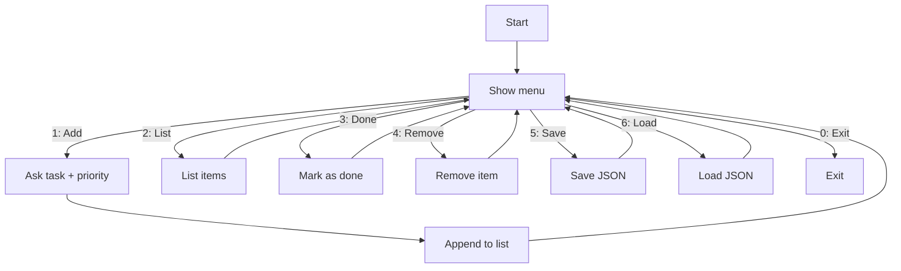

# Interactive Text App (CLI)

**Lyhyt esittely:**  
Interaktiivinen komentorivisovellus, jossa käyttäjä hallitsee tehtävälistaa (lisää, listaa, merkitse tehdyksi, poista, tallenna/lataa). 
Hyödyntää aliohjelmia, silmukoita, listoja/sanakirjoja, virheenkäsittelyä ja tiedostonkäsittelyä.

## Käynnistys
```bash
python -m venv .venv
# Windows
.venv\Scripts\activate
# macOS/Linux
source .venv/bin/activate
pip install -r requirements.txt
python main.py
```

## Vuokaavio
- `docs/flowchart.drawio` (diagrams.net)
- `docs/flowchart.mmd` (Mermaid)



## GitHub-työskentely
1) Luo uusi repo → lisää kollaboraattorit (*Settings → Collaborators*).  
2) Jokainen kloonaa repon ja avaa VS Codessa:
```bash
git clone <repo-url>
cd interactive-text-app
code .
```
3) Branch-malli:
```bash
git switch -c feature/<nimi>
# tee muutokset
git add .
git commit -m "Kuvaava viesti"
git push -u origin feature/<nimi>
```
4) Avaa Pull Request → katselmointi → merge.

## Video
https://youtu.be/I0qY3iGNEJo
